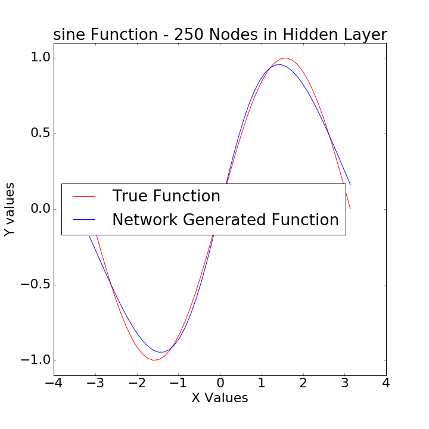
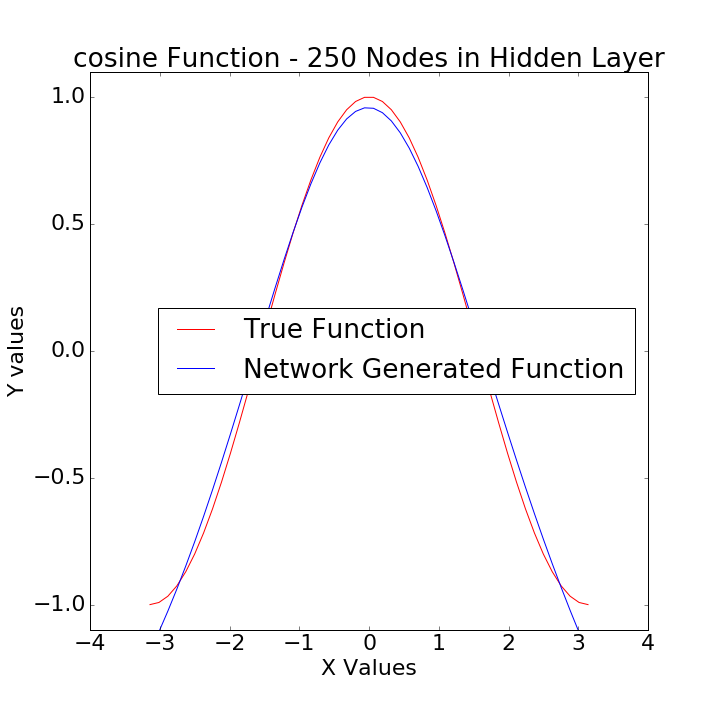
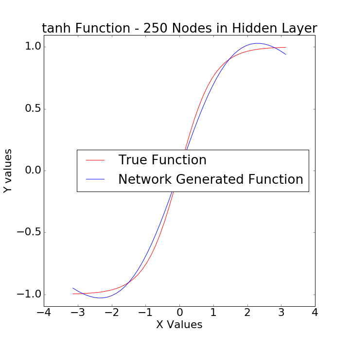
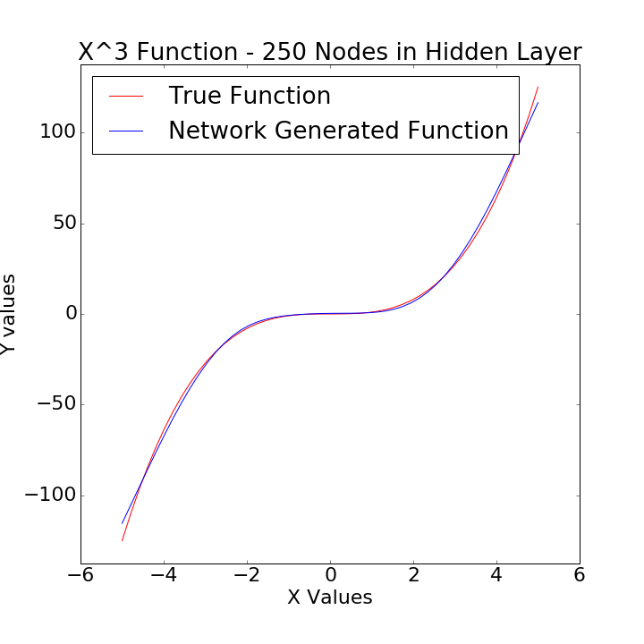
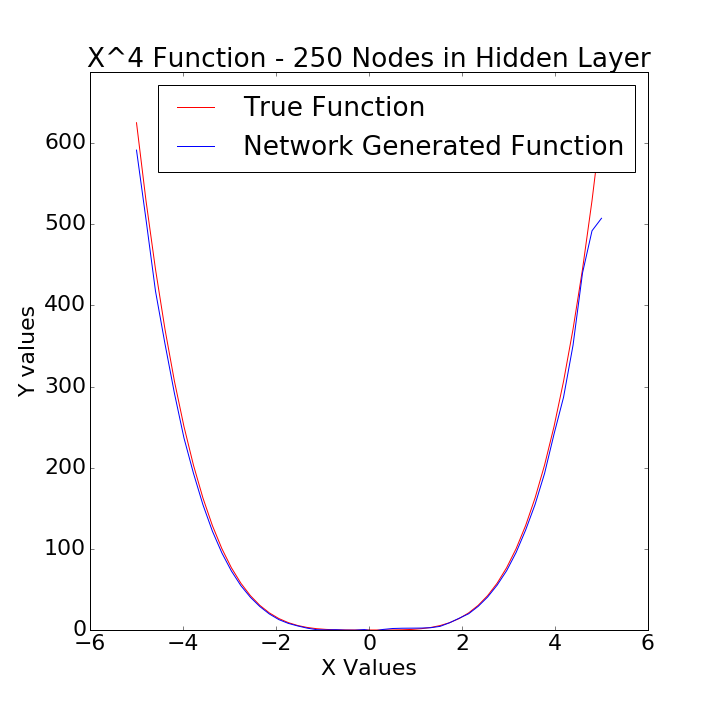

# Shallow Neural Networks

This mini-book works from first principles, starting with simple linear regression and building up to a small, simple neural network. It assumes a reasonably good understanding of simple/multiple linear regression, multiple logistic regression, and gradient descent. It also assumes a reasonable level of familiarity with Python.

The goal of this mini-book is to introduce the basic concepts behind neural networks through a simple, familiar problem (linear/logistic regression), and then solidify those concepts in building a **shallow** neural network (don't worry, we'll discuss exactly what that means). To that degree, a lot of the chapters repeat some of the same concepts and terminology in the hopes of building a solid foundation.

A second goal of this mini-book (and the subsequent books) is to introduce these concepts within a couple of different frameworks - `numpy`, `theano`, `tensorflow`, and `keras`. While in practice we'd never run neural networks in `numpy`, it's helpful to code them up using it in order to completely grasp how everything is working. `theano` and `tensorflow` are libraries we can use to run neural networks, but they have somewhat of a steep learning curve. The goal in using these (especially with simple, familiar problems) is to be able to focus on the code and the library, and not so much the problem itself. Finally, `keras` has the least steep learning curve, and is an extensive, powerful neural networks library that it will be extremely useful to know. 

By the end of this mini-book, we will have built a neural network that is able to learn arbitrary math functions ...

  
 

